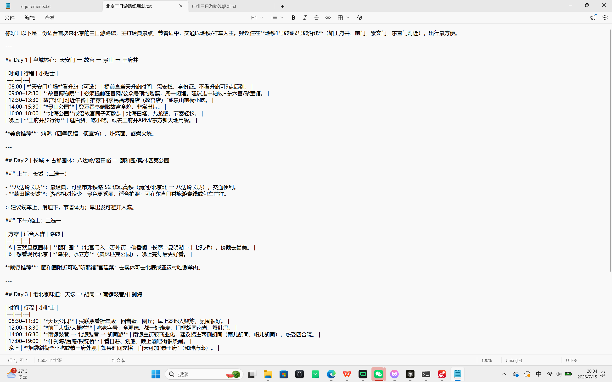
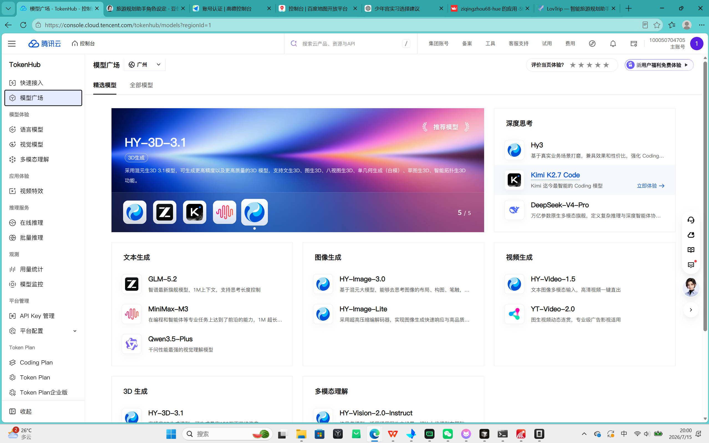
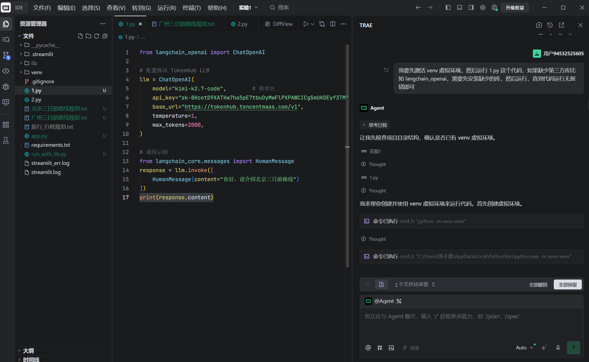
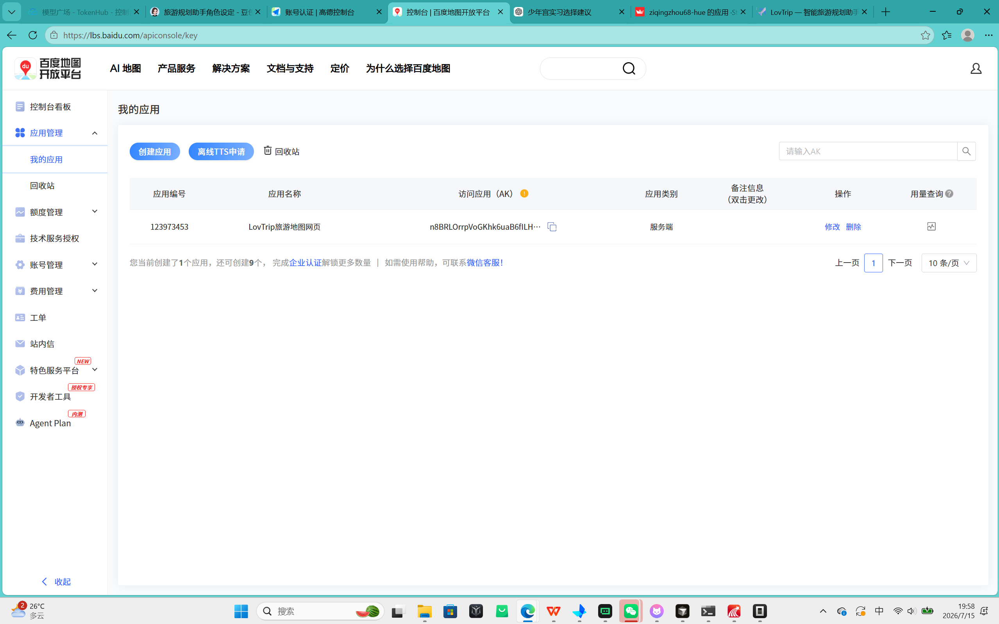
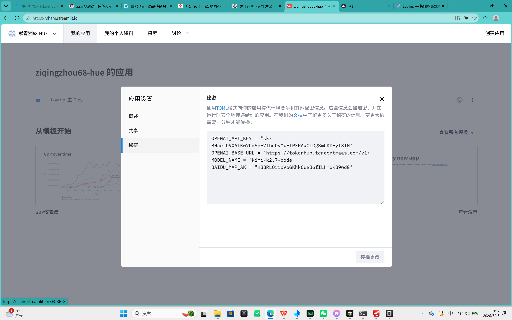
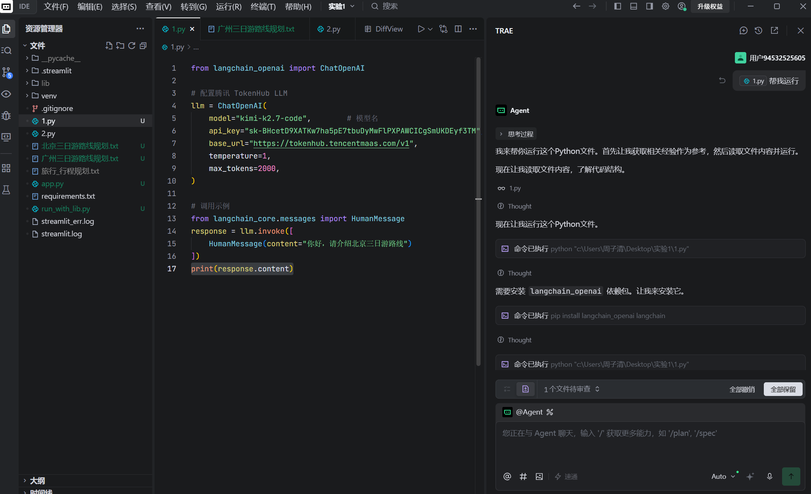
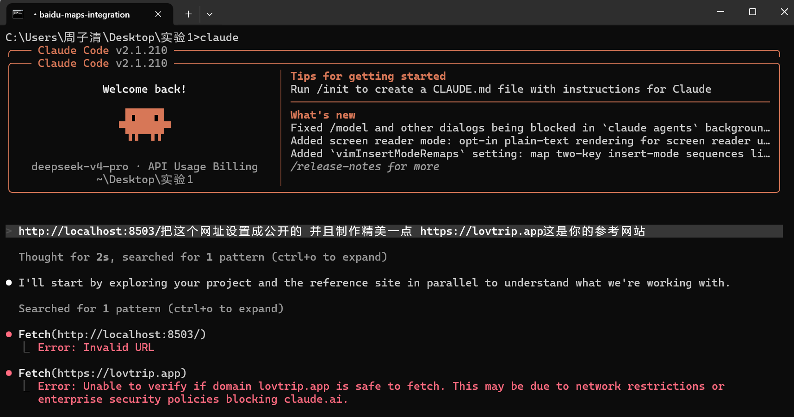
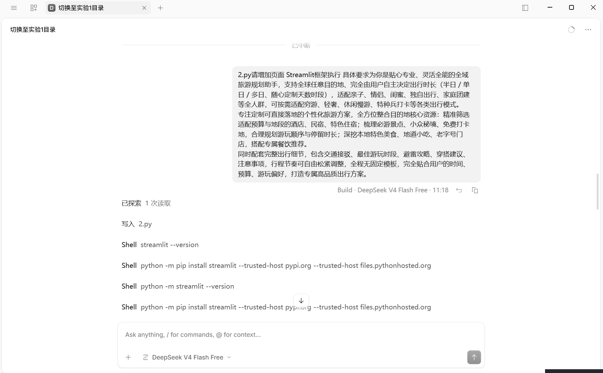
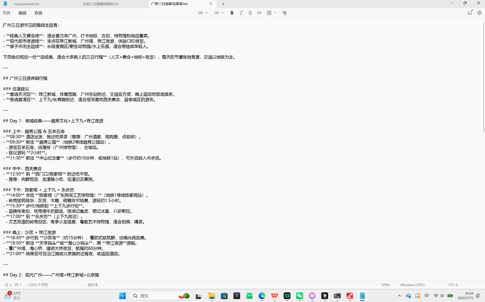
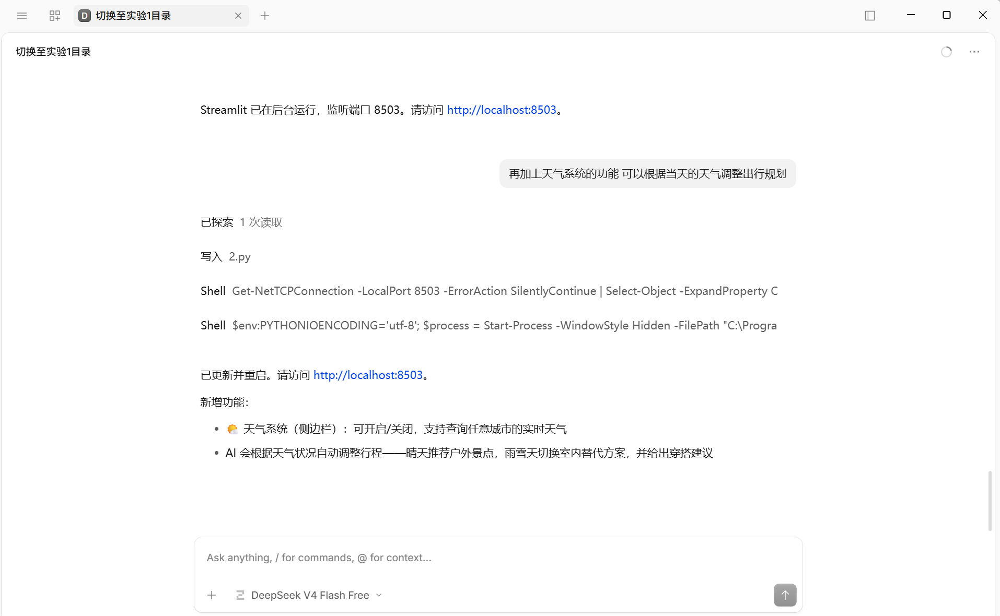

<p align="center">
  
</p>

<h1 align="center">LovTrip · 智能旅游规划助手</h1>

<p align="center">
  <strong>AI-Powered Travel Planner — 全球目的地 · 一键生成专属旅行方案</strong>
</p>

<p align="center">
  <a href="https://lovtrip-yrnuxdx28kuusajze24prq.streamlit.app/" target="_blank">
    
  </a>
  <a href="https://github.com/ziqingzhou68-hue/lovtrip/blob/main/LICENSE">
    
  </a>
  
  
  
</p>

<p align="center">
  <a href="#-项目简介">项目简介</a> ·
  <a href="#-项目展示">项目展示</a> ·
  <a href="#-功能特色">功能特色</a> ·
  <a href="#-快速开始">快速开始</a> ·
  <a href="#-技术栈">技术栈</a> ·
  <a href="#-项目结构">项目结构</a> ·
  <a href="#-使用示例">使用示例</a> ·
  <a href="#-项目亮点">项目亮点</a>
</p>

---

## ✈️ 项目简介

**LovTrip** 是一款基于 AI 大语言模型的智能旅游规划应用。只需输入目的地和出行偏好，AI 即可在数十秒内为您生成包含景点、酒店、美食、天气、地图的完整旅行方案。

> 🎓 本项目同时作为 **人工智能学院 FDE 课程设计** 成果，展示 AI Agent 在实际产品中的应用。

### 核心能力

| 功能 | 说明 |
|------|------|
| 🧠 **AI 行程规划** | 基于 LLM 自动生成个性化旅行方案，支持全球任意目的地 |
| 🏨 **智能推荐** | 精准推荐酒店、景点、美食，附带评分和实景照片 |
| 🎨 **现代化 UI** | LovTrip Premium 主题，玻璃态卡片设计，渐变动效 |
| 🚀 **一键部署** | 支持 Streamlit Cloud 一键部署，零运维成本 |

### 适用场景

- 👨‍👩‍👧‍👦 亲子出游 — 推荐亲子友好景点
- 💑 情侣旅行 — 浪漫打卡路线
- 🎒 独自探险 — 深度人文体验
- 👯 朋友结伴 — 热门网红打卡
- 🏢 家庭团建 — 多人协调行程

---

## 📸 项目展示

### 在线体验

🔗 **https://lovtrip-yrnuxdx28kuusajze24prq.streamlit.app/**

### 应用截图

<p align="center">
  <em>主界面 — AI 智能旅行规划</em>
</p>

<p align="center">
  
  
</p>

<p align="center">
  <em>左：AI 生成旅行方案 | 右：目的地地图与景点探索</em>
</p>

<p align="center">
  
  
</p>

<details>
<summary>📸 更多截图（点击展开）</summary>
<p align="center">
  
  
  
  
  
  
</p>
</details>

---

## ✨ 功能特色

### 🧠 AI 智能旅行规划
- 支持全球任意目的地（北京、东京、巴黎、纽约...）
- 自由设定出行天数（2天1晚、7天6晚...）
- 多种出行模式：经典游玩、穷游、轻奢、休闲慢游、特种兵打卡
- 全人群适配：独自出行、情侣、亲子、闺蜜、家庭团建、朋友结伴
- 多档预算：经济、适中、轻奢、奢华

### 🏨 酒店 / 景点 / 美食推荐
- 百度地图 API 实时搜索周边 POI
- 卡片式展示，渐变色彩设计
- 评分 ⭐ 可视化展示
- Pexels 真实照片（自动 fallback 到百度静态地图）
- 分类 Tab 切换：景点 | 酒店 | 美食

### 🌤️ 天气查询
- Open-Meteo 免费天气 API（全球覆盖）
- 实时温度、天气状况、风速
- AI 根据天气自动调整行程建议
- 雨中推荐室内景点，晴天推荐户外活动

### 🗺️ 地图展示
- Leaflet 交互式地图（开源免费，无 API Key 限制）
- 目的地 + 周边 POI 标记
- 拖拽缩放，点击查看详情
- 自动适配所有标记视角

### 📥 旅行方案导出
- 一键下载完整旅行规划为 TXT 文件
- Markdown 格式，包含 emoji 和分级标题

---

## 🚀 快速开始

### 前提条件

- Python 3.9+
- Git

### 1. Clone 项目

```bash
git clone https://github.com/ziqingzhou68-hue/lovtrip.git
cd lovtrip
```

### 2. 安装依赖

```bash
pip install -r requirements.txt
```

### 3. 配置 API Key

**方式一：环境变量（推荐本地开发）**

```bash
cp .env.example .env
# 编辑 .env 文件，填入你的 API Key
```

**方式二：Streamlit Secrets（推荐 Streamlit Cloud 部署）**

```bash
cp .streamlit/secrets.toml.example .streamlit/secrets.toml
# 编辑 secrets.toml，填入你的 API Key
```

### 4. 启动应用

```bash
streamlit run streamlit_app.py
```

浏览器访问 `http://localhost:8501` 即可使用。

### 所需 API Key

| 服务 | 环境变量 | 获取方式 | 必需 |
|------|----------|----------|------|
| LLM API | `OPENAI_API_KEY` | TokenHub / OpenAI | ✅ 是 |
| 百度地图 | `BAIDU_MAP_AK` | [百度地图开放平台](https://lbsyun.baidu.com/apiconsole/key) | ✅ 是 |
| Pexels 图片 | `PEXELS_API_KEY` | [Pexels API](https://www.pexels.com/api/) | ❌ 可选 |

> 💡 **免费额度充足**：百度地图 API 每日免费调用量足够个人使用；Open-Meteo 天气 API 完全免费。

---

## 🛠️ 技术栈

| 层级 | 技术 | 说明 |
|------|------|------|
| **UI 框架** | [Streamlit](https://streamlit.io/) | Python 纯 Web 框架，零前端代码 |
| **AI 引擎** | Kimi K2 / GPT 兼容 API | 通过 TokenHub 调用，支持 OpenAI 兼容接口 |
| **地图服务** | [Leaflet](https://leafletjs.com/) | 开源免费地图库，无需 API Key |
| **POI 搜索** | [百度地图 API](https://lbsyun.baidu.com/) | 地点搜索、地理编码 |
| **天气数据** | [Open-Meteo](https://open-meteo.com/) | 免费开源天气 API |
| **图片服务** | [Pexels API](https://www.pexels.com/api/) | 高质量旅行实景照片 |

---

## 📁 项目结构

```
lovtrip/
│
├── streamlit_app.py              # 🚀 主应用入口（Streamlit）
├── requirements.txt              # 📦 生产依赖
├── requirements-dev.txt          # 🔧 开发依赖
├── pyproject.toml                # ⚙️ 项目配置（black/ruff/pytest）
├── .env.example                  # 🔑 环境变量模板
├── .gitignore                    # 🙈 Git 忽略规则
│
├── config/                       # ⚙️ 配置模块
│   └── __init__.py               #    API Key 加载 / System Prompt
│
├── services/                     # 🌐 服务层（外部 API 调用）
│   ├── __init__.py
│   ├── baidu_map.py              #    百度地图：地理编码 + 地点搜索
│   └── weather.py                #    天气服务：Open-Meteo API
│
├── components/                   # 🎨 UI 组件层（可复用渲染函数）
│   ├── __init__.py
│   ├── styles.py                 #    LovTrip Premium CSS 主题
│   ├── map.py                    #    Leaflet 交互式地图渲染
│   └── poi.py                    #    POI 卡片网格 + Pexels 图片
│
├── tests/                        # 🧪 测试
│   ├── __init__.py
│   ├── test_config.py            #    配置模块测试
│   ├── test_services.py          #    服务层 API Mock 测试
│   └── test_components.py        #    UI 组件单元测试
│
├── docs/                         # 📄 文档
│   ├── architecture.md           #    系统架构设计
│   ├── development.md            #    开发指南
│   ├── deployment.md             #    部署指南
│   ├── project_design.md         #    项目设计文档（课程设计用）
│   └── course/                   #    课程设计相关材料
│
├── screenshots/                  # 📸 应用截图
│
├── .streamlit/                   # Streamlit 配置
│   ├── secrets.toml.example      #    Secrets 配置模板
│   └── secrets.toml              #    实际 Secrets（已 gitignore）
│
├── README.md                     # 📖 项目说明
├── LICENSE                       # ⚖️ MIT 许可证
├── CHANGELOG.md                  # 📝 变更日志
├── CONTRIBUTING.md               # 🤝 贡献指南
├── CODE_OF_CONDUCT.md            # 📋 行为准则
└── SECURITY.md                   # 🔒 安全策略
```

---

## 📝 使用示例

### 输入

```
请为我规划广州三日游，出行模式为经典游玩，预算适中。
```

### 输出

AI 自动生成包含以下内容的完整旅行方案：

```markdown
## 🗺️ 广州三日游

### 📅 Day 1：老城经典 — 越秀文化 + 上下九 + 珠江夜游
- 🏛️ 上午：越秀公园 & 五羊石像
- 🍜 中午：西关美食（向群饭店、伍湛记及第粥）
- 🏯 下午：陈家祠 + 上下九 + 永庆坊
- 🚢 晚上：沙面岛 + 珠江夜游

### 📅 Day 2：现代广州 — 广州塔 + 珠江新城 + 北京路
...

### 📅 Day 3：白云山 / 长隆（二选一）
...

### 💡 实用贴士
| 交通 | 地铁刷码乘车... |
| 美食 | 早茶推荐陶陶居... |
| 天气 | 当前 28°C 晴，适合户外... |
```

---

## 🌟 项目亮点

### 1. 🎨 现代 UI 设计
- LovTrip Premium 渐变色主题
- 玻璃态（Glassmorphism）卡片
- 流畅的 CSS 动画（浮动图标、淡入效果）
- 完全自定义 Streamlit 样式

### 2. ⚡ 响应速度
- Open-Meteo 免费天气 API：毫秒级响应
- Leaflet 地图：纯前端渲染，零服务端开销
- 流式 LLM 输出：边生成边展示

### 3. 🧠 Prompt Engineering
- 精心设计的 System Prompt
- 天气自适应：根据实时天气调整行程
- 人群适配：不同出行人群推荐不同玩法
- Markdown 格式输出：emoji + 分级标题 + 重点加粗

### 4. 🤖 AI Agent 思想
- 单一入口 → 自动编排多服务调用
- 天气数据注入 LLM 上下文
- 地图 POI 实时搜索 + AI 推荐融合

### 5. 🧩 模块化设计
- 清晰的分层架构：Config → Services → Components → UI
- 纯函数组件，易于测试和复用
- 环境变量优先，安全配置管理

---

## ⚠️ 项目限制

- **需要网络连接**：所有 API 调用均需联网
- **API 配额限制**：百度地图 API 每日有免费调用次数限制
- **LLM 费用**：需要有效的 LLM API Key 并可能有调用费用
- **中文优化**：System Prompt 针对中文旅游场景优化，英文目的地也使用中文回答
- **POI 数据精度**：依赖百度地图数据，部分海外目的地 POI 可能不够丰富
- **天气精度**：Open-Meteo 为免费服务，极端天气预测可能有偏差

---

## 🧪 开发

```bash
# 安装开发依赖
pip install -r requirements-dev.txt

# 运行测试
pytest tests/ -v

# 代码格式化
black .
ruff check .

# 启动开发服务器
streamlit run streamlit_app.py
```

---

## 🤝 贡献

欢迎 Issue 和 PR！详见 [CONTRIBUTING.md](./CONTRIBUTING.md)。

## 📄 许可证

MIT License — 详见 [LICENSE](./LICENSE)。

---

<p align="center">
  <strong>Made with ❤️ by LovTrip Team</strong><br>
  <sub>Powered by TokenHub LLM · Leaflet Maps · Open-Meteo Weather</sub>
</p>
